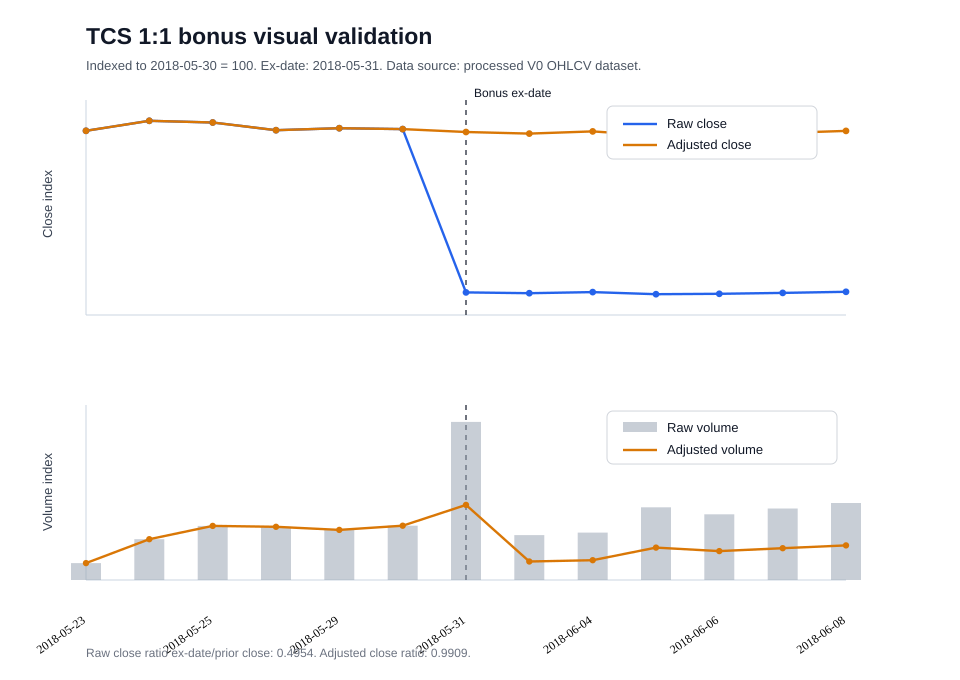

# Corporate-Action Visual Validation V0

**Status:** Evidence artifact

This note records one real split-or-bonus visual check required by the Phase 1
acceptance criteria. It uses a research-period corporate action for a frozen
V0-universe symbol and does not run any strategy logic.

## Event

| Field | Value |
| --- | --- |
| Symbol | `TCS` |
| Company | Tata Consultancy Services Ltd. |
| Ex-date | `2018-05-31` |
| Event type | `BONUS` |
| Purpose | `Bonus 1:1 /Dividend- Rs 29 Per Share` |
| Parsed price factor | `0.5000000000` before the ex-date |
| Parsed volume factor | `2.0000000000` before the ex-date |
| Dataset | `nifty100_v0_adjusted_ohlcv_d039` |
| Source CSV | `data/processed/nifty100_v0_adjusted_ohlcv.csv` |
| Source CSV SHA-256 | `74f25a13116f5658201870ee6ae7c35ac5d27153ccbf3b65909e078355f75b4e` |
| Inspection window | `2018-05-23..2018-06-08` |

The event is inside the pre-registered research period:

```text
2016-01-01 through 2022-12-31
```

The validation holdout was not inspected for strategy performance, and no
validation-period strategy runs were executed for this artifact.

## Visual Check



The chart indexes both raw and adjusted series to the final pre-event trading
day, `2018-05-30 = 100`.

## Close Continuity

| Date | Raw Close | Adjusted Close | Price Factor |
| --- | ---: | ---: | ---: |
| `2018-05-30` | `3514.10` | `1757.050` | `0.5000000000` |
| `2018-05-31` | `1741.05` | `1741.050` | `1.0000000000` |

| Check | Value |
| --- | ---: |
| Raw close ratio, ex-date / prior close | `0.4954469139` |
| Adjusted close ratio, ex-date / prior close | `0.9908938277` |
| Expected ex-date raw close from prior raw close and 1:1 bonus | `1757.05` |
| Ex-date raw close versus expected adjusted prior close | `-0.9106172277%` |

The raw close approximately halves across the bonus ex-date. After
backward-adjusting the pre-event history by `0.5`, the adjusted close series no
longer contains a mechanical 50% discontinuity. The remaining `-0.91%` move is
the ordinary market move between `2018-05-30` and `2018-05-31`.

## OHLC And Volume

| Date | Raw Volume | Adjusted Volume | Volume Factor |
| --- | ---: | ---: | ---: |
| `2018-05-30` | `1889553` | `3779106.000000` | `2.0000000000` |
| `2018-05-31` | `5049371` | `5049371.000000` | `1.0000000000` |

The reciprocal volume adjustment doubles pre-event volume and leaves ex-date
volume unchanged. The same price factor is applied consistently to raw open,
high, low, and close before the ex-date; the ex-date and later bars keep unit
price and volume factors.

## Interpretation

This real-event check supports the V0 split/bonus convention:

- a `Bonus 1:1` record is interpreted as one new equity share for each existing
  share;
- pre-event prices are backward-adjusted by `0.5`;
- pre-event volume is adjusted by `2.0`;
- the adjusted close series removes the mechanical ex-date discontinuity.

This artifact validates data adjustment only. It does not promote any Phase 1
strategy, does not inspect the 2023-2026 validation holdout for strategy
performance, and does not change the B001/B002/B003 rejection status.
